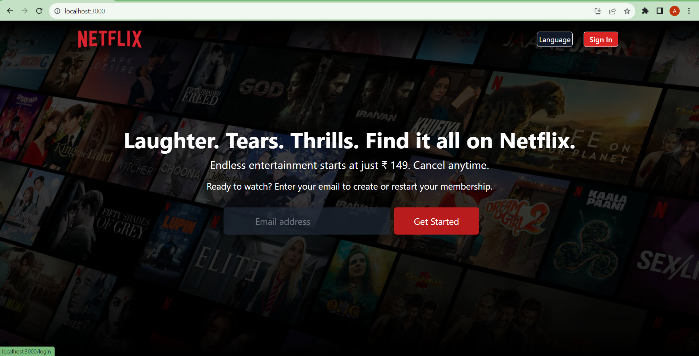
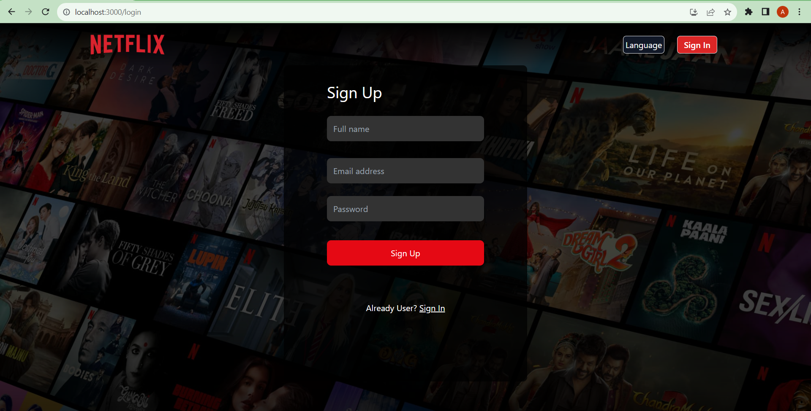
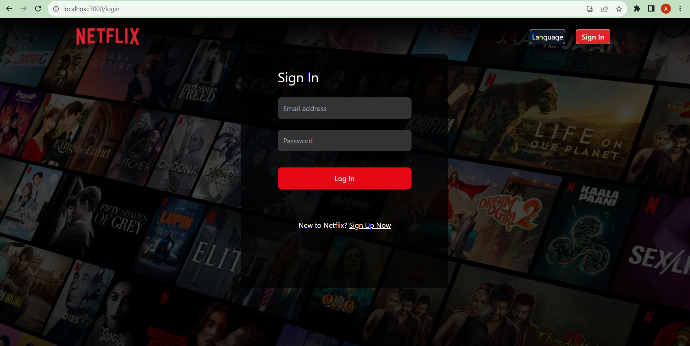
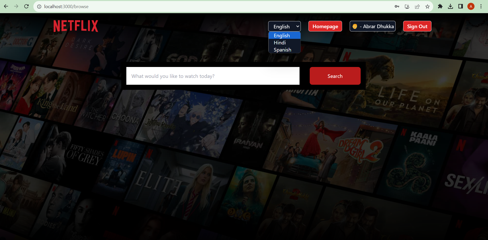
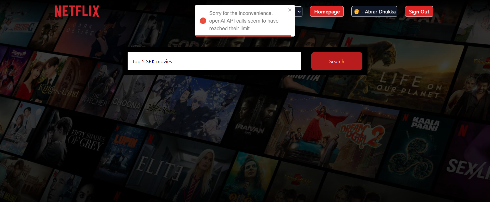

# [Nflix-GPT](https://nflix-gpt.vercel.app/login)
 - a Movie recommendation (AI Based) web app that I developed using React.js!

# Key functionalities that I've implemented:
 - User Authentication using Firebase
 - List of Movies (Recent, Upcoming, Popular etc) using TMDB API 
 - Protected Route - only Logged in users can visit Browse page
 - Routing to Different Pages for smooth navigation
 - Multi-Language feature
 - Integration of OpenAI API
 - GPT Search - User can give his command and it will suggest movies accordingly
 - Responsive to All devices

# I incorporated various key concepts including :
 - useEffect
 - useState
 - Router
 - Redux Toolkit
 - Controlled components
 - lifting state up
 - Iframe
 - Usage of Custom hooks
 - SOLID principles
 - Conditional rendering
 - API Integration
 - Tailwind 
 - Env variables

 - I used TMDB API data in this project.
 - Throughout this project, I focused exclusively on front-end development, sharpening my skills in React.js and enhancing my understanding of building robust and engaging user interfaces.

### DemoVideo
https://clipchamp.com/watch/nhKIVUfUbLW

### Homepage

### SignUpPage

### SignInPage

### BrowsePage

### GptSearcHBarPage

### ApiError

### MovieRecommendationPage

### MovieRecommendationPage

For more details or Collaboration, feel free to contact me at abrdhk@gmail.com.

Thanks